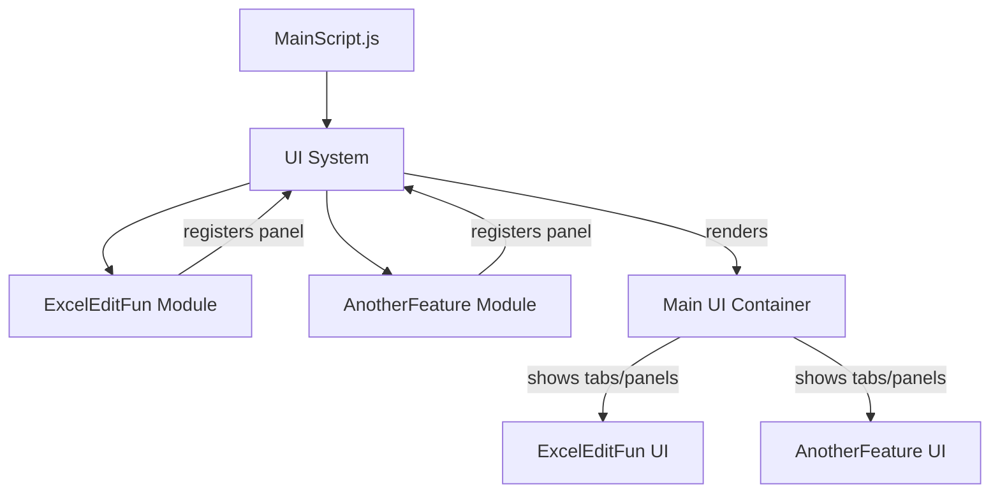

# Modular Tampermonkey Script System – Architecture & Implementation Plan

## Overview

This document outlines the architecture and implementation plan for a modular Tampermonkey script system, designed for the `/editor` page. The system enables easy addition of new features and UI panels, ensuring a unified, extensible, and maintainable user interface.

---

## 1. Architecture

- **MainScript.js**: Entry point. Injects a single main UI container (sidebar or floating panel) and provides a UI API for feature modules.
- **JS/**: Directory for feature modules (e.g., `JS/ExcelEditFun.js`), each loaded via `@require` and registering their UI with the main container.
- **UI System**: Centralized, extensible, and styled consistently. Each feature module registers a panel/tab/section, making it easy to add or remove features.

---

## 2. UI System Design

- **Main Container**: Sidebar or floating panel, fixed to the page, with tabbed navigation for each feature.
- **UI API**: Exposes a `registerPanel({ id, title, render })` method for modules to add their UI.
- **Consistent Styling**: All panels use the same base styles for a unified look.
- **Easy Extensibility**: New features only need to call the UI API to add their UI.

---

## 3. Feature Module Pattern

- Each module exports a function or object that registers its UI and logic with the main UI system.
- No direct DOM injection; all UI is managed by the main container.

---

## 4. Example Structure

```
MainScript.js
  |
  |-- UI System (main container, tabbed interface)
  |-- Loads feature modules via @require
        |
        |-- JS/ExcelEditFun.js (registers "Excel Explode" panel)
        |-- JS/AnotherFeature.js (registers another panel)
        |-- ...
```

---

## 5. Mermaid Diagram



---

## 6. Implementation Steps

1. **Build the UI System in MainScript.js**:
    - Create a main container (sidebar or floating panel).
    - Implement tabbed navigation.
    - Expose a `registerPanel` API.

2. **Refactor Feature Modules**:
    - Each module exports a function/object that registers its UI via the API.
    - Move UI creation logic from modules to the main UI system.

3. **Document the API**:
    - Provide clear instructions for adding new features.

---

## 7. Notes

- `/editor` is a safe URL for UI injection and modification.
- Implementation will use vanilla JS for maximum compatibility and simplicity.

---

## 8. Next Steps

- Implement the UI system in `MainScript.js`.
- Refactor `JS/ExcelEditFun.js` to use the new modular UI API.
- Add documentation for future feature modules.