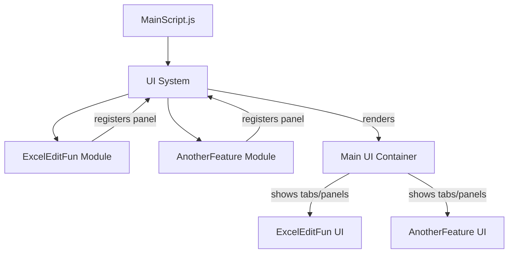

# Modular Tampermonkey Script System – Architecture & Implementation Plan

## Overview

This document outlines the architecture and implementation plan for a modular Tampermonkey script system, designed for the `/editor` page. The system provides a full-page, unified UI with a sidebar for navigation, a main content area for feature panels, and a persistent file preview panel. It enables easy addition of new features and UI panels, ensuring a unified, extensible, and maintainable user interface. Shared file state and preview logic are provided for all modules.

---

## 1. Architecture

- **MainScript.js**: Entry point. Replaces the page with a full-page app layout: a sidebar (for navigation, file upload/reset), a main content area (for feature panels), and a persistent file preview panel. Provides a UI API for feature modules and manages shared file state.
- **JS/**: Directory for feature modules (e.g., `JS/ExcelEditFun.js`, `JS/SplitBy.js`, etc.), each loaded via `@require` and registering their UI panel with the main UI system.
- **UI System**: Centralized, extensible, and styled consistently. Each feature module registers a panel/tab/section, making it easy to add or remove features. The main script manages navigation, layout, and shared state, while modules are responsible for their own panel DOM.
- **Shared File State & Preview**: A global file state manager (`window.TM_FileState`) and persistent preview panel are available to all modules for consistent file handling and preview.

---

## 2. UI System Design

- **Full-Page App Layout**: The UI is a full-page app with three main areas:
  - **Sidebar**: Contains navigation tabs for feature panels, file upload/reset controls.
  - **Main Content Area**: Displays the currently active feature panel.
  - **Persistent Preview Panel**: Always visible on the right, shows a preview of the loaded file.
- **UI API**: Exposes a `registerPanel({ id, title, render })` method for modules to add their UI as a panel.
- **Consistent Styling**: All panels use the same base styles for a unified look, but modules are responsible for their own DOM within their panel root.
- **Easy Extensibility**: New features only need to call the UI API to add their UI.
- **Shared File State**: All panels access and update file state via `window.TM_FileState`. The preview panel updates automatically.

---

## 3. Feature Module Pattern

- Each module registers a panel with the main UI system by calling `window.TM_UI.registerPanel({ id, title, render })`.
- The `render` function returns a DOM element that is mounted in the main content area.
- Modules are responsible for creating and managing their own DOM within their panel root, but should use the provided styles for consistency.
- Modules interact with shared file state and can trigger preview refreshes as needed.

---

## 4. Example Structure

```
MainScript.js
  |
  |-- UI System (main container, tabbed interface)
  |-- Loads feature modules via @require
        |
        |-- JS/ExcelEditFun.js (registers "Excel Explode" panel)
        |-- JS/AnotherFeature.js (registers another panel)
        |-- ...
```

---

## 5. Mermaid Diagram



---

## 6. Implementation Steps

1. **Build the UI System in MainScript.js**:
    - Replace the page with a full-page app layout: sidebar, main content, persistent preview.
    - Implement tabbed navigation for feature panels in the sidebar.
    - Add file upload and reset/clear controls to the sidebar.
    - Expose a `registerPanel` API for feature modules.
    - Implement a persistent preview panel and shared file state manager.

2. **Implement/Refactor Feature Modules**:
    - Each module registers its UI panel via the API.
    - Each module is responsible for its own DOM within the panel area, using the provided styles.
    - Modules interact with shared file state and can trigger preview refreshes.

3. **Document the API and Architecture**:
    - Provide clear instructions for adding new features and using shared file state/preview.

---

## 7. Shared File State & Preview

- **File State Manager**: `window.TM_FileState` provides methods to get/set the current workbook, sheet, and data. File state is persisted in localStorage.
- **Persistent Preview Panel**: Always visible, shows a preview of the loaded file (first 30 rows by default). Updates automatically when file state changes.
- **Preview Refresh**: Modules can trigger a preview refresh via `window.TM_RefreshPreview()` if needed.

---

## 8. Notes

- `/editor` is a safe URL for UI injection and modification.
- Implementation uses vanilla JS for maximum compatibility and simplicity.
- Feature modules should avoid global side effects outside their panel root.

---

## 9. Next Steps

- Implement the UI system in `MainScript.js`.
- Refactor feature modules in `JS/` to use the modular UI API and shared file state.
- Add documentation for future feature modules.