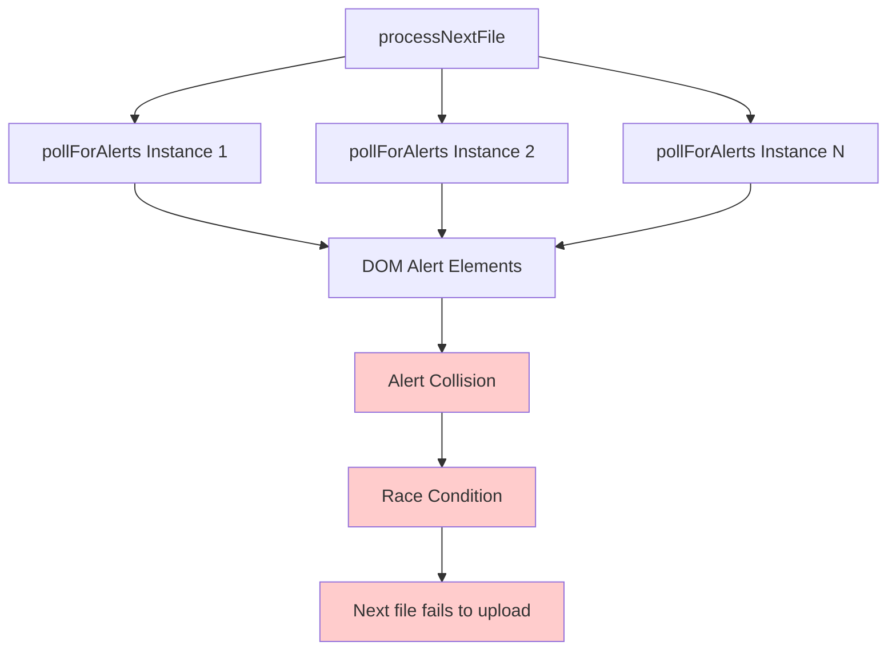
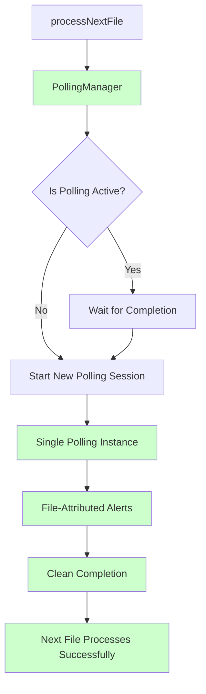
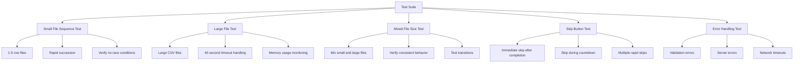
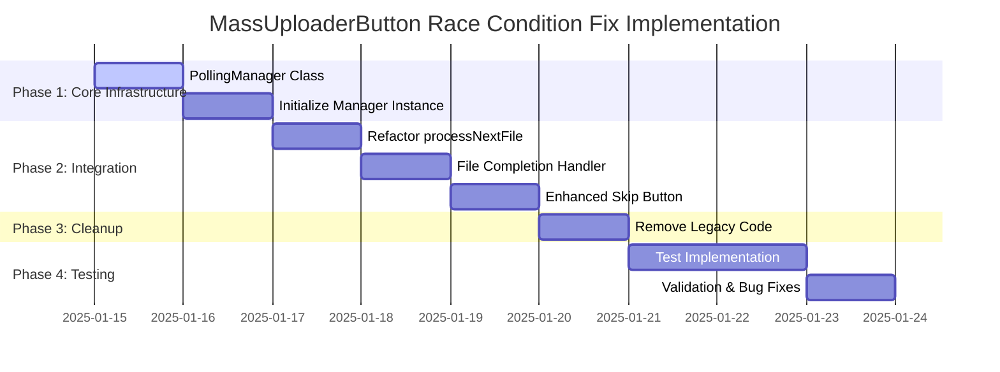

# MassUploaderButton.js Comprehensive Race Condition Fix - Implementation Plan

## Overview

This document provides a detailed implementation plan for the comprehensive solution to eliminate all race conditions in MassUploaderButton.js. The solution implements a centralized polling management system that ensures sequential file processing and prevents alert collision.

## Current vs New Architecture

### Current Problematic Architecture


### New Managed Architecture


## Implementation Phases

### Phase 1: Core Infrastructure (Days 1-2)

#### 1.1 PollingManager Class Implementation

**Location**: Add after line 921 (after chunkCSVFile function)

```javascript
/**
 * Centralized polling manager to prevent race conditions
 * Ensures only one polling instance is active at a time
 */
class PollingManager {
    constructor() {
        this.activePolling = null;
        this.processedAlerts = new Map(); // fileId -> Set of alert IDs
        this.pollingInterval = null;
        this.maxPollingTime = 45000; // 45 seconds
        this.pollingFrequency = 100; // Poll every 100ms
        this.alertCleanupDelay = 100; // Small delay for cleanup
    }
    
    /**
     * Start polling for a specific file
     * @param {File} file - The file being processed
     * @param {number} fileIndex - Index of the file in the upload queue
     * @returns {Promise} Promise that resolves with polling result
     */
    async startPolling(file, fileIndex) {
        console.log(`[PollingManager] Starting polling for file: ${file.name} (index: ${fileIndex})`);
        
        // Ensure no active polling
        if (this.activePolling) {
            console.log('[PollingManager] Waiting for existing polling to complete...');
            await this.waitForCompletion();
        }
        
        // Clean up previous alerts to prevent cross-contamination
        this.cleanupPreviousAlerts();
        
        // Start new polling session
        const fileId = `file_${fileIndex}_${Date.now()}`;
        return new Promise((resolve, reject) => {
            this.activePolling = {
                file,
                fileIndex,
                fileId,
                resolve,
                reject,
                startTime: Date.now(),
                alertsDetected: [],
                completed: false,
                finalOutcome: null
            };
            
            console.log(`[PollingManager] Created polling session: ${fileId}`);
            this.startPollingLoop();
        });
    }
    
    /**
     * Start the main polling loop
     */
    startPollingLoop() {
        let elapsed = 0;
        
        this.pollingInterval = setInterval(() => {
            if (!this.activePolling || this.activePolling.completed) {
                this.stopPolling();
                return;
            }
            
            this.checkForAlerts();
            
            elapsed += this.pollingFrequency;
            if (elapsed >= this.maxPollingTime) {
                console.log(`[PollingManager] Polling timeout for ${this.activePolling.file.name}`);
                this.completePolling('timeout');
            }
        }, this.pollingFrequency);
    }
    
    /**
     * Check for new alerts and process them
     */
    checkForAlerts() {
        const alertElements = document.querySelectorAll('div[mdn-alert-message]');
        
        alertElements.forEach(alertElement => {
            if (this.shouldProcessAlert(alertElement)) {
                this.processAlert(alertElement);
            }
        });
    }
    
    /**
     * Determine if an alert should be processed by current polling session
     * @param {Element} alertElement - The alert DOM element
     * @returns {boolean} Whether to process this alert
     */
    shouldProcessAlert(alertElement) {
        const fileId = this.activePolling.fileId;
        
        // Skip if already processed by this file
        if (alertElement.dataset.muProcessedBy === fileId) {
            return false;
        }
        
        // Skip if processed by any file (prevent cross-contamination)
        if (alertElement.dataset.muProcessed === 'true') {
            return false;
        }
        
        return true;
    }
    
    /**
     * Process a single alert element
     * @param {Element} alertElement - The alert DOM element to process
     */
    async processAlert(alertElement) {
        const fileId = this.activePolling.fileId;
        const file = this.activePolling.file;
        
        // Mark as processed by this file to prevent reprocessing
        alertElement.dataset.muProcessedBy = fileId;
        alertElement.dataset.muProcessed = 'true';
        alertElement.dataset.muFileIndex = this.activePolling.fileIndex;
        
        const alertText = alertElement.innerText.trim();
        console.log(`[PollingManager] Processing alert for ${file.name}: ${alertText.substring(0, 100)}...`);
        
        try {
            const classification = await classifyAlert(alertElement, alertText, file.name);
            this.activePolling.alertsDetected.push(classification);
            
            // Update UI based on classification
            this.updateFileStatus(classification);
            
            // Check if this alert indicates completion
            if (this.shouldCompletePolling(classification)) {
                console.log(`[PollingManager] Completing polling with outcome: ${classification.type}`);
                this.completePolling(classification.type);
            }
        } catch (error) {
            console.error(`[PollingManager] Error processing alert for ${file.name}:`, error);
        }
    }
    
    /**
     * Update file status in UI based on alert classification
     * @param {Object} classification - Alert classification result
     */
    updateFileStatus(classification) {
        const file = this.activePolling.file;
        
        switch (classification.type) {
            case 'success_file':
                updateStatusRow(file, 'success', classification.message);
                this.activePolling.finalOutcome = 'success';
                break;
            case 'partial_failure':
                updateStatusRow(file, 'warning', classification.message);
                this.activePolling.finalOutcome = 'partial_failure';
                break;
            case 'validation_error':
            case 'server_error':
                updateStatusRow(file, 'error', classification.message);
                this.activePolling.finalOutcome = 'error';
                break;
            case 'partial_success':
                // Partial success usually comes with partial failure, don't override outcome
                if (!this.activePolling.finalOutcome) {
                    console.log('[PollingManager] Partial success detected, waiting for more alerts...');
                }
                break;
            default:
                if (classification.severity === 'success') {
                    updateStatusRow(file, 'success', classification.message);
                    this.activePolling.finalOutcome = 'success';
                }
        }
    }
    
    /**
     * Determine if polling should complete based on alert classification
     * @param {Object} classification - Alert classification result
     * @returns {boolean} Whether to complete polling
     */
    shouldCompletePolling(classification) {
        // Complete on definitive outcomes
        if (['success_file', 'validation_error', 'server_error'].includes(classification.type)) {
            return true;
        }
        
        // Handle partial failure + partial success combination
        const hasPartialFailure = this.activePolling.alertsDetected.some(alert => alert.type === 'partial_failure');
        const hasPartialSuccess = this.activePolling.alertsDetected.some(alert => alert.type === 'partial_success');
        
        if (hasPartialFailure && hasPartialSuccess) {
            return true;
        }
        
        // Wait for potential partial_success after partial_failure
        if (hasPartialFailure && !hasPartialSuccess) {
            const elapsed = Date.now() - this.activePolling.startTime;
            return elapsed >= 3000; // 3 second wait
        }
        
        return false;
    }
    
    /**
     * Complete the current polling session
     * @param {string} outcome - Final outcome of the polling
     */
    completePolling(outcome) {
        if (!this.activePolling || this.activePolling.completed) {
            return;
        }
        
        console.log(`[PollingManager] Completing polling for ${this.activePolling.file.name} with outcome: ${outcome}`);
        
        this.activePolling.completed = true;
        this.stopPolling();
        
        const result = {
            outcome: outcome || this.activePolling.finalOutcome || 'success',
            alerts: this.activePolling.alertsDetected,
            file: this.activePolling.file,
            fileIndex: this.activePolling.fileIndex,
            fileId: this.activePolling.fileId
        };
        
        // Small delay to ensure all DOM updates complete
        setTimeout(() => {
            this.activePolling.resolve(result);
            this.activePolling = null;
        }, this.alertCleanupDelay);
    }
    
    /**
     * Stop the polling interval
     */
    stopPolling() {
        if (this.pollingInterval) {
            clearInterval(this.pollingInterval);
            this.pollingInterval = null;
        }
    }
    
    /**
     * Clean up alerts from previous polling sessions
     */
    cleanupPreviousAlerts() {
        console.log('[PollingManager] Cleaning up previous alerts');
        
        // Remove old processed markers to prevent buildup
        const oldAlerts = document.querySelectorAll('div[mdn-alert-message][data-mu-processed="true"]');
        let cleanedCount = 0;
        
        oldAlerts.forEach(alert => {
            // Only clean up alerts that are not from the current session
            if (this.activePolling && alert.dataset.muProcessedBy === this.activePolling.fileId) {
                return; // Skip current session alerts
            }
            
            delete alert.dataset.muProcessed;
            delete alert.dataset.muProcessedBy;
            delete alert.dataset.muFileIndex;
            cleanedCount++;
        });
        
        console.log(`[PollingManager] Cleaned up ${cleanedCount} old alert markers`);
    }
    
    /**
     * Wait for current polling to complete
     * @returns {Promise} Promise that resolves when polling is complete
     */
    async waitForCompletion() {
        if (!this.activePolling) {
            return;
        }
        
        return new Promise((resolve) => {
            const checkCompletion = () => {
                if (!this.activePolling || this.activePolling.completed) {
                    resolve();
                } else {
                    setTimeout(checkCompletion, 50);
                }
            };
            checkCompletion();
        });
    }
    
    /**
     * Check if polling is currently active
     * @returns {boolean} Whether polling is active
     */
    isPollingActive() {
        return this.activePolling !== null && !this.activePolling.completed;
    }
}
```

#### 1.2 Initialize PollingManager Instance

**Location**: Add after line 1061 (with other upload variables)

```javascript
// Initialize polling manager for centralized alert handling
const pollingManager = new PollingManager();
```

### Phase 2: Integration (Days 3-4)

#### 2.1 Refactor processNextFile Function

**Location**: Replace existing processNextFile function (lines 1338-1431)

```javascript
/**
 * Process the next file in the upload queue
 * Uses managed polling to prevent race conditions
 */
async function processNextFile() {
    console.log(`[MassUploader] processNextFile() called - Index: ${currentUploadIndex}/${filesToUpload.length}`);
    
    if (currentUploadIndex >= filesToUpload.length) {
        // All files processed - show summary
        console.log('[MassUploader] All files processed, showing summary');
        showUploadSummary();
        uploadButton.disabled = false;
        skipWaitButton.style.display = 'none';
        isUploading = false;
        return;
    }

    const file = filesToUpload[currentUploadIndex];
    console.log(`[MassUploader] Processing file ${currentUploadIndex + 1}/${filesToUpload.length}: ${file.name}`);
    
    // Update status to "Injecting"
    updateStatusRow(file, 'injecting');

    // Send file to page context via postMessage (bypasses userscript sandbox restrictions)
    window.postMessage({ type: 'MU_SET_FILE', file }, '*');

    try {
        // Use managed polling instead of direct pollForAlerts call
        const result = await pollingManager.startPolling(file, currentUploadIndex);
        console.log(`[MassUploader] File ${file.name} completed with result:`, result);
        
        // Handle the completion result
        await handleFileCompletion(file, result);
        
    } catch (error) {
        console.error(`[MassUploader] Error processing file ${file.name}:`, error);
        updateStatusRow(file, 'error', error.message);
        
        // Handle error completion
        await handleFileCompletion(file, {
            outcome: 'error',
            alerts: [{ message: error.message, type: 'error' }],
            file: file,
            fileIndex: currentUploadIndex
        });
    }
}
```

#### 2.2 New File Completion Handler

**Location**: Add new function after processNextFile

```javascript
/**
 * Handle completion of a file upload
 * @param {File} file - The completed file
 * @param {Object} result - Result from polling manager
 */
async function handleFileCompletion(file, result) {
    const { outcome, alerts } = result;
    
    console.log(`[MassUploader] Handling completion for ${file.name} with outcome: ${outcome}`);
    
    // Handle different outcomes
    if (outcome === 'error') {
        // For critical errors, ask user if they want to continue
        const alertMessage = alerts[alerts.length - 1]?.message || 'Unknown error';
        const shouldContinue = confirm(
            `Critical error occurred with file "${file.name}":\n\n${alertMessage}\n\nDo you want to continue with the remaining files?`
        );
        
        if (!shouldContinue) {
            // Stop processing
            console.log('[MassUploader] User chose to stop processing after error');
            showUploadSummary();
            uploadButton.disabled = false;
            skipWaitButton.style.display = 'none';
            isUploading = false;
            return;
        }
    }
    
    // Update failed files tracking
    if (outcome === 'partial_failure' || outcome === 'error') {
        const alertMessage = alerts[alerts.length - 1]?.message || 'Unknown error';
        if (!failedFiles.some(f => f.file === file && f.reason === alertMessage)) {
            failedFiles.push({
                file: file,
                reason: alertMessage,
                type: outcome
            });
        }
    }
    
    // Increment index only after processing is complete
    currentUploadIndex++;
    
    // Schedule next file (if not the last one)
    if (currentUploadIndex < filesToUpload.length) {
        skipWaitButton.style.display = 'block';
        
        // Determine wait time based on outcome
        let waitTime = 30000; // Default 30 seconds
        if (outcome === 'error' || outcome === 'partial_failure') {
            waitTime = 10000; // Shorter wait for failed files
        }
        
        // Start countdown timer
        let timeRemaining = Math.floor(waitTime / 1000);
        const nextFileName = filesToUpload[currentUploadIndex].name;
        
        // Update button text immediately
        skipWaitButton.innerText = `Skip Wait (${timeRemaining}s) - Next: ${nextFileName}`;
        
        // Countdown interval
        const countdownInterval = setInterval(() => {
            timeRemaining--;
            if (timeRemaining > 0) {
                skipWaitButton.innerText = `Skip Wait (${timeRemaining}s) - Next: ${nextFileName}`;
            } else {
                clearInterval(countdownInterval);
            }
        }, 1000);
        
        countdownIntervals.push(countdownInterval);
        
        const nextTimeout = setTimeout(() => {
            clearInterval(countdownInterval);
            skipWaitButton.style.display = 'none';
            processNextFile();
        }, waitTime);
        
        uploadTimeouts.push(nextTimeout);
    } else {
        // Last file, show summary and re-enable upload
        setTimeout(() => {
            showUploadSummary();
            uploadButton.disabled = false;
            skipWaitButton.style.display = 'none';
            isUploading = false;
        }, 1000);
    }
}
```

#### 2.3 Enhanced Skip Button Implementation

**Location**: Replace existing skip button event listener (lines 1572-1581)

```javascript
// Enhanced skip wait button functionality with race condition prevention
skipWaitButton.addEventListener('click', async () => {
    console.log('[MassUploader] Skip button clicked');
    
    // Clear any pending timeouts and countdown intervals
    uploadTimeouts.forEach(timeout => clearTimeout(timeout));
    countdownIntervals.forEach(interval => clearInterval(interval));
    uploadTimeouts = [];
    countdownIntervals = [];
    
    // Ensure any active polling completes before proceeding
    if (pollingManager.isPollingActive()) {
        console.log('[MassUploader] Waiting for active polling to complete before skip...');
        skipWaitButton.innerText = 'Waiting for completion...';
        skipWaitButton.disabled = true;
        
        await pollingManager.waitForCompletion();
        
        skipWaitButton.disabled = false;
    }
    
    skipWaitButton.style.display = 'none';
    
    // Small delay to ensure cleanup completes
    setTimeout(() => {
        processNextFile();
    }, 100);
});
```

### Phase 3: Remove Legacy Code (Day 5)

#### 3.1 Remove Original pollForAlerts Function

**Location**: Remove lines 1219-1336 (original pollForAlerts function)

The original `pollForAlerts` function will be completely replaced by the `PollingManager` class methods.

#### 3.2 Update Function Calls

Search for any remaining direct calls to `pollForAlerts` and ensure they're replaced with `pollingManager.startPolling`.

### Phase 4: Testing & Validation (Days 6-7)

#### 4.1 Test Scenarios



#### 4.2 Validation Checklist

- [ ] No race conditions with small files (1-5 rows)
- [ ] Large files still process correctly
- [ ] Skip button works without timing issues
- [ ] Alert attribution prevents cross-contamination
- [ ] Memory cleanup prevents buildup
- [ ] Error handling maintains user experience
- [ ] All existing functionality preserved
- [ ] Performance is maintained or improved

## Implementation Timeline



## Risk Mitigation

### 1. Implementation Risks
- **Risk**: Breaking existing functionality during refactor
- **Mitigation**: Implement in phases with testing at each step
- **Rollback Plan**: Keep original code commented until validation complete

### 2. Performance Risks
- **Risk**: Single polling instance creates bottlenecks
- **Mitigation**: Optimize polling frequency and implement intelligent timeouts
- **Monitoring**: Add performance logging to detect issues

### 3. Edge Case Risks
- **Risk**: Unexpected alert patterns not handled
- **Mitigation**: Comprehensive testing with various file types and sizes
- **Fallback**: Maintain timeout-based completion as safety net

## Success Criteria

1. **Zero Race Conditions**: No instances of "next file doesn't upload correctly"
2. **Sequential Processing**: Files process in exact order without overlap
3. **Alert Attribution**: 100% accurate alert-to-file mapping
4. **Backward Compatibility**: All existing functionality preserved
5. **Performance**: No degradation in upload speed or responsiveness
6. **Skip Button**: Works reliably without timing restrictions
7. **Error Handling**: Proper recovery from all error scenarios

## Post-Implementation Monitoring

### 1. Logging Strategy
- Add comprehensive logging for debugging
- Monitor polling session lifecycle
- Track alert processing accuracy
- Log performance metrics

### 2. User Feedback Collection
- Monitor for any reported issues
- Collect performance feedback
- Track error rates and types

### 3. Continuous Improvement
- Analyze logs for optimization opportunities
- Refine polling parameters based on usage patterns
- Add additional safeguards as needed

This comprehensive implementation plan provides a robust solution to eliminate all race conditions while maintaining existing functionality and providing a foundation for future enhancements.